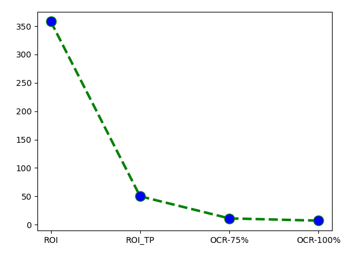
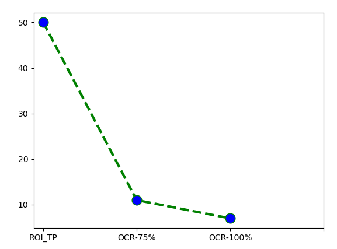
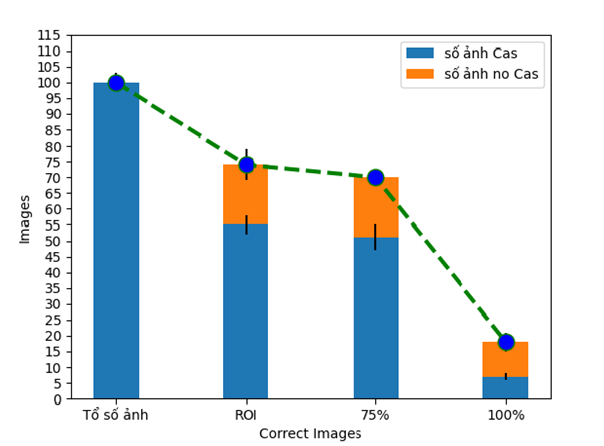

<html>

 <strong>
  <h1>i use custom HaarCasscade to train my model at this address "https://www.cs.auckland.ac.nz/~m.rezaei/Tutorials/Creating_a_Cascade_of_Haar-Like_Classifiers_Step_by_Step.pdf"
  </h1>
 </strong>

<h3>1.Faces detect</h3>
- my model with 35 images positive, 400 images negative (i dont have data and my computer not strong to train) 
- Evaluation model (work on data set :(( )
    
  - With IOU = 0.5, set model scaleFactors(multiScale) = 1.01 (1%)
   
   ReCall: 65.7% , TP = 23, sum = 35
    
   Predection: 95.83%, TP = 23 and FP = 1
      
  - With IOU = 0.5, set mode; scaleFactors(multiScale) = 1.05 (5%)
    
   ReCall: 40% , TP = 14, sum = 35
    
   Predection: 100%, TP = 14 and FP = 0
    

<h3>2. Number-Plate-motobike detect (private)</h3>
- my model with 200 positive, 400 images negative (special condition)  
- Evaluation model (work on data set :(( )
  
 - With IOU = 0.5, set model scaleFactors(multiScale) = 1.01 (1%) 
   ReCall: 73.68% , TP = 154 and sum = 209 
   Predection: 96.85% , TP = 154 and FPS = 5  
 - With IOU = 0.5, set model scaleFactors(multiScale) = 1.05 (5%) 
   ReCall: 29.19% , TP = 61 and sum = 209 
   Predection: 95.31% , TP = 61 and FP = 3 

<h3>3. Number-Plate-cars detect</h3>
- my model with 100 positive, 200 images negative (special condition)  
- Evaluation model (work on data set :(( )
  
  - With IOU = 0.5, set model scaleFactors(multiScale) = 1.01 (1%) 
   Recall: 50% , TP = 50 and sum = 100 
   Predection: 13.97% , TP = 50 and FP = 308  
  - With IOU = 0.5, set model scaleFactors(multiScale) = 1.05 (5%) 
   Recall: 51% , TP = 51 and sum = 100 
   Predection: 20.9% , TP = 51 and FP = 163  
   
 Note: Result so bad cause by the conditions of images 
 compare to result of haarcascade_russian_plate_number (on my data)  
 - With IOU = 0.5, set model scaleFactors(multiScale) = 1.01 (1%) 
   Recall: 43% , TP = 44 and sum = 108 
   Predection: 12.29% , TP = 44 and FP = 314  
 - With IOU = 0.5, set model scaleFactors(multiScale) = 1.05 (5%) 
   Recall: 35% , TP = 38 and sum = 108 
   Predection: 17.35% , TP = 38 and FP = 181 
<h3> 4. Number-Plate-cars detect combine detect text by OCR </h3>
OCR-75% or 75% that mean OCR read correct 75%
OCR or 100% that mean OCR read correct 100%

 
<h4> This show data Recall </h4>

 

<h4> This show data Recall of OCR via tesseract</h4>

 

  <h4> This show data Recall of special conditions and add more funtions in code</h4>

</html>
